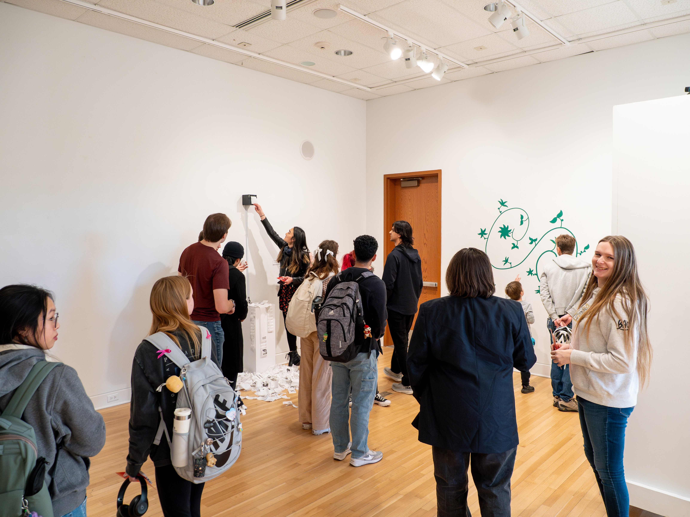
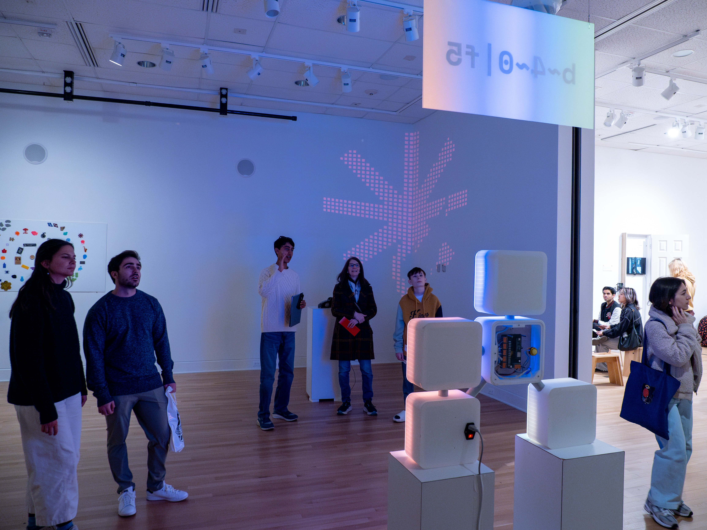
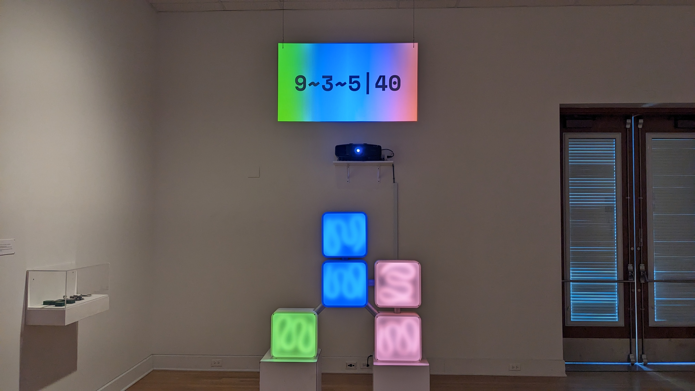
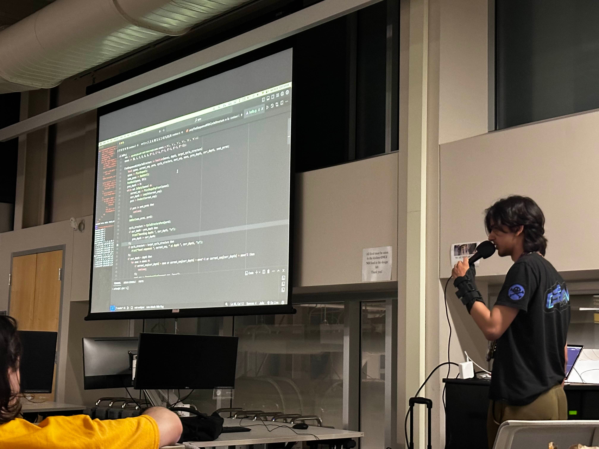
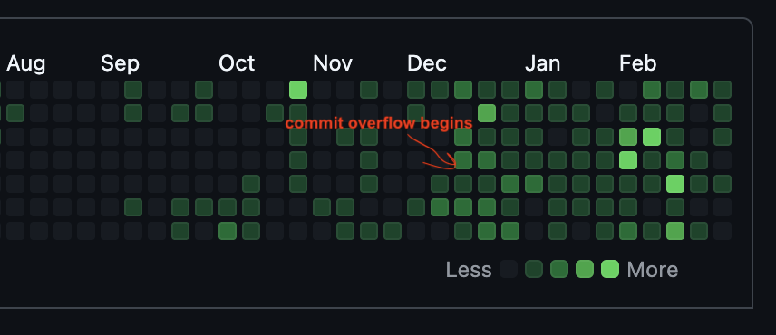

# VIP Newsletter 4

Dear friends,

[In November](https://blog.purduehackers.com/vip-newsletter/the-highest-peaks-yet), I wrote about feeling continually surprised by Purdue Hackers’ growing scale and quality. These ever-growing peaks have been the result of a fast-growing number of community members who care deeply about Purdue Hackers & put their souls into it.

When I began running Purdue Hackers in 2022, I felt like I was carrying a torch alone, dreaming of the day that Purdue Hackers would no longer be downstream of me. Today’s update represents that dream becoming reality: our demo day in an art gallery, new build-in-public sessions at Hack Night, and month-long commit challenge, happened only because so many people—who are not me—made them happen.

_This is the_ [_Purdue Hackers_](https://purduehackers.com) _VIP Newsletter._ [_Read the previous edition here._](https://blog.purduehackers.com/vip-newsletter/the-highest-peaks-yet) _If you’d rather not receive these,_ [_unsubscribe here_](https://docs.google.com/forms/d/e/1FAIpQLSff6JvHc7istmPqk63lkCHtqOlkoQR8bxjn-rj_aKsEXlvMRg/viewform)_._

## BURST ✷

On December 8th, 2024, we ran a 4-hour pop-up gallery exhibition called **BURST ✷**, featuring 9 projects built at Hack Night over the past year.

Over 200 people stopped by (including the [Dean of the College of Science](https://www.linkedin.com/posts/lucy-flesch-7b8799301_burst-student-made-creative-technical-activity-7275147902383976449-q8ru)), grabbed [a badge](https://blog.purduehackers.com/posts/the-best-badge) and a drink at our (non-alcoholic) bar, and walked through an exhibition of hacker-made creative technical projects.

Some of the featured projects:

* [The Sign](https://blog.purduehackers.com/posts/sign), a meter-tall Conway glider which tells the time via colors
* [keymashed](https://github.com/kartva/keymashed), a Rust app that throttles the network on your computer unless you mash your keyboard
* [ETea](https://store.steampowered.com/app/3085040/ETea/), a video game about an alien bobarista far from home
* NFC-enabled [Republic of Hackerland Passports](https://blog.purduehackers.com/posts/papers-please)

There was something so magical about reimagining these scrappy technical projects, which were never intended to be art, as serious art pieces for an exhibition in an actual gallery. I think the Sign was my favorite installation:

I’m so proud of this event & grateful for the dozens of students who helped set it up, as well as [Purdue Galleries](https://www.cla.purdue.edu/academic/rueffschool/galleries/) for allowing us to use one of their galleries.

BURST ✷ was the first iteration of the Show, a yearly demo day which takes a different name, brand, and form every time it runs. The 2024 Show was a gallery exhibition; the 2025 Show will be entirely different. I’m so excited to see what the community will do next year.

If you want to feel inspired today, [check out the photos we took at BURST ✷.](https://drive.google.com/drive/folders/1G-i7CHLLMjMnGWK8lWlWlEmuW2TTFF-P?usp=sharing)

[View all featured projects](https://burst.purduehackers.com/)

## 🏁 How we cracked demos

For the past 6 months, Hack Night, our weekly mini-hackathon, has included a midnight demo session called **🏁Checkpoints**. We’ve mentioned it in the previous two editions ([#1](https://blog.purduehackers.com/vip-newsletter/the-highest-peaks-yet), [#2](https://blog.purduehackers.com/vip-newsletter/the-plan-is-in-motion)), but the last couple months have proven it to be a resounding success. Dozens of people build in public & share what they’re working on every week. It’s what was missing from Hack Night.

Checkpoints and BURST ✷ reinforced each other for project creators: BURST ✷ was a milestone to look forward to, and Checkpoints were energizing playtesting sessions.

You’d think a hackathon-flavored event like Hack Night would have been running demo sessions since its inception—but it took us two years and three and a half tries to finally run Checkpoints. The story of how we succeeded is the story of how Hack Night came to look the way it does.

Read: [How We Cracked Demos](https://blog.purduehackers.com/posts/how-we-cracked-demos)

## 🟩 Commit Overflow

Over winter break, we challenged our community to make meaningful progress on a technical project every day. **Commit Overflow** [has been running since 2022](https://blog.purduehackers.com/posts/commit-overflow-2023), but this year’s was the best yet.

From December 18th to January 12th, 43 community members shared 633 commits; 13 of them shared an update every day for 26 days straight. Some of my favorite projects were a toy cloud, [an iOS exploit to use Lightning Time as the system clock](https://github.com/leminlimez/LightningTime), and a conlang.

Many of this year’s participants have continued their streak long after Commit Overflow ended. Look at this GitHub chart!

## 🚢 Magic, Wins, and Ships

* The [keymashed](https://github.com/kartva/keymashed) installation at BURST ✷ got its creator, Kartavya, an internship at Neuralink this summer. From his [“Optimizing Purdue CS” Gist](https://gist.github.com/kartva/30c528420d68869dbcf376cd028fe038):
> My experiences at Purdue Hackers have defined my experience at Purdue. Every week, the single-most thing I look forward to is Hack Night. I’ve grown and done impressive things purely influenced by the culture of technical excellence present at this club. There are many unbelievably competent and passionate people in the Purdue Hackers community and a lot of them are now my friends.
> 
> A somewhat gimmicky way to express the potential impact that being part of a club can have: a presentation on a project I made for fun at Purdue Hackers eventually resulted in an internship offer at Neuralink.
* Community member Julian has been playtesting a VR laser tag game for Meta Quest, which does real-time room scanning, at Hack Night. Videos from these playtesting sessions went viral on [Twitter](https://x.com/trev3d/status/1878857186220412955?t=Z9UdRoN_h44ot7GMoZ3EkQ&s=19) and [Reddit](https://www.reddit.com/r/OculusQuest/comments/1i58p6b/testing_my_lasertag_game_with_some_friends/?rdt=40409).
* Community member Michael wrote a blog post chronicling the things he shipped every day during Commit Overflow, and [published it on his website](https://shad.moe/posts/3lhbw3a4tis2r/).
* Community members Arhan and Henry worked with cubing YouTuber TheGrayCuber on two videos about using a Rubik’s Cube as a computer, the first one of which was released & has 10,000 views: [The Largest Rubik’s Cube Calculator](https://youtu.be/Dq4z--4pVFY?si=ep8uX_DUT8QMEpQZ)

## 📣 Our Asks

* **If you’re an alum or individual:** Please consider covering pizza for our next Hack Night. Food is our largest expense & covering it allows us to fund more student projects. We spend $200 per Hack Night, but anything helps. [Donate here](https://hcb.hackclub.com/donations/start/purdue-hackers)
    
* **If you represent a company:** We want to get you at our Fall 2025 Show as a sponsor. It’ll be our biggest Show ever with an incredible talent pool. Please reach out!
    
* **If you’re Purdue faculty:** Please consider spreading the word about Purdue Hackers to your students. You can view all upcoming Hack Nights and workshops on our [events site](https://events.purduehackers.com).

For everyone: please reply to this email with feedback on this newsletter. I want this to be something you continue to be excited to read every month, and I welcome your suggestions for how we can make it better.

With 💛, 
Matthew

[Unsubscribe](https://docs.google.com/forms/d/e/1FAIpQLSff6JvHc7istmPqk63lkCHtqOlkoQR8bxjn-rj_aKsEXlvMRg/viewform)